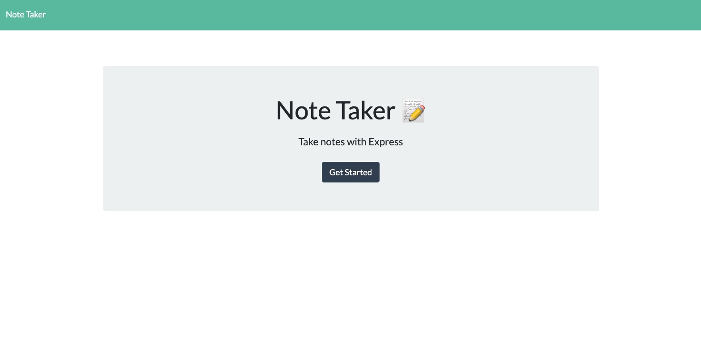
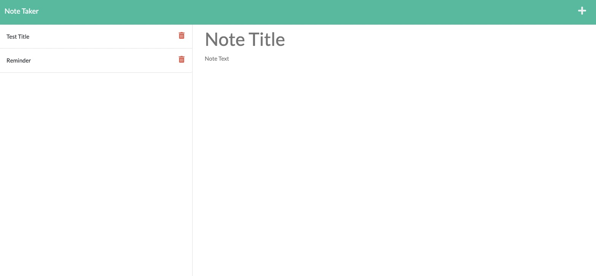

# Note Taker App: note-taker

Module 11 - Express.js Challenge: Note Taker

---

## Description

This application was created with the purpose of having an application to take notes as needed. It currently has the ability to write / delete notes that contain a title and some text using a database.

The main goal of this application was to add, delete and update a database with data for each of the notes that a user may have. This specifically challenged recently learned skills to navigate a simple database using express. This is the first application that I have worked on that uses a database to store and access data, instead of using local storage.

### Requirements

A list of requirements derived from acceptance criteria and personal goals:

- Create an application that allows users to create, delete, and edit various notes.
- Functioning save, add, and delete icons.
- Use a database to hold note information.
- Use express to access and navigate the database using different routes.

### Skills Learned/ Improved

Here is a list of some skills I learned and/or improved throughout this project:

- Using express to create routes to navigate the database
- Organizing files into various directories based on file purpose/use
- JavaScript for frontend and backend development
- Using local ports

Tools used to complete this project:

- VS Code
- Terminal
- GitHub
- Heroku
- Node.js
- get-uid
- Express

## Installation

To access the current application, click the link to the deployed application in the [Links Section](#links) of this README.

To install the application:

1. Open the GitHub repository.
2. Click the blue code dropdown button, select the preferred cloning method, and clone code to device.
3. Open the clone code in preferred code editor.
4. You now have access of all of the file contents.

## Usage

This note taker application can be used by anyone who needs to take notes with the ability to delete them as needed. It consists of a home page with a "Get Started" button that goes to the page containing all of the notes.

### Links

This application has been deployed using Heroku. Click the link below to access the application.

[Link](https://note-taker-m11.herokuapp.com/) to the deployed application.

[Link](https://github.com/alverson98/note-taker) to code repository.

## Questions

You may contact me with any questions or concerns through the email provided or my GitHub.

Email: alverson98@yahoo.com

GitHub: https://github.com/alverson98

## Credits

I received guidance and tips from the instructional staff, TA's, and Students from the University of Denver Coding Boot Camp.
